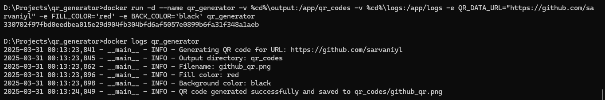

# Docker QR Code Generator

This project combines Docker with Python to create a containerized application that generates QR codes. The QR code contains a URL (by default, a GitHub profile) and can be scanned with a smartphone camera to open the target website.

## Project Overview

This application uses:
- Python with the `qrcode` library to generate QR codes
- Docker for containerization and easy deployment
- Environment variables for customization

## QR Code Image

Below is the QR code that links to my GitHub profile:

<!-- Insert your QR code image here once generated -->


## Build & Run Logs

Below is a screenshot showing the successful creation of the QR code:

<!-- Insert your log image here once generated -->


## Prerequisites

- [Docker](https://www.docker.com/get-started/) installed on your system
- Docker account (sign up at [Docker Hub](https://hub.docker.com/))

## Files in this Repository

- `qr_generator.py`: Python script that generates the QR code
- `Dockerfile`: Instructions for building the Docker image
- `requirements.txt`: Python dependencies
- `docker-compose.yaml`: Docker Compose configuration for building and running the container.
- `README.md`: This documentation file, providing information about the repository and its usage.

## Setup Instructions

### 1. Clone this repository

```bash
git clone <your-repo-url>
cd <repository-directory>
```

### 2. Build the Docker image

```bash
docker build -t my-qr-app .
```

### 3. Run the Docker container

Basic usage with default settings (generates QR code for the default GitHub URL):

```bash
docker run -d --name qr-generator my-qr-app
```

### 4. Copy the QR code from the container to your local machine

```bash
docker cp qr-generator:/app/qr_codes/github_qr.png ./github_qr.png
```

### 5. View the logs to confirm successful generation

```bash
docker logs qr-generator
```

## Customization Options

### Custom URL

```bash
docker run -d --name qr-generator \
  -e QR_DATA_URL='https://github.com/yourusername' \
  my-qr-app
```

### Custom Colors

```bash
docker run -d --name qr-generator \
  -e FILL_COLOR='blue' \
  -e BACK_COLOR='yellow' \
  my-qr-app
```

### Custom Output

```bash
docker run -d --name qr-generator \
  -e QR_CODE_FILENAME='custom_qr.png' \
  my-qr-app
```

### Using Volume Mounting

To directly save the QR code to your host machine:

```bash
docker run -d --name qr-generator \
  -v $(pwd)/output:/app/qr_codes \
  my-qr-app
```

### Setting URL via Command Line

```bash
docker run my-qr-app --url 'https://github.com/yourusername'
```

## Common Docker Commands

| Command | Description |
|---------|-------------|
| `docker build -t image_name .` | Build a Docker image |
| `docker run --name container_name image_name` | Run a container in foreground |
| `docker run -d --name container_name image_name` | Run a container in detached mode |
| `docker ps` | List running containers |
| `docker stop container_name` | Stop a container |
| `docker rm container_name` | Remove a container |
| `docker images` | List Docker images |
| `docker rmi image_name` | Remove a Docker image |
| `docker logs container_name` | View container logs |

## How It Works

1. The Python script uses the `qrcode` library to generate a QR code for the specified URL
2. The script accepts parameters via environment variables or command-line arguments
3. Docker containerizes the application, making it easy to run on any system with Docker installed
4. The generated QR code is saved within the container and can be accessed using Docker commands

## Learning Resources

- [Containerization vs. Virtualization](https://www.netapp.com/blog/containers-vs-vms/)
- [Official Docker Getting Started Guide](https://docs.docker.com/get-started/)
- [Entrypoint vs. CMD vs. RUN in Dockerfile](https://stackoverflow.com/questions/21553353/what-is-the-difference-between-cmd-and-entrypoint-in-a-dockerfile)
